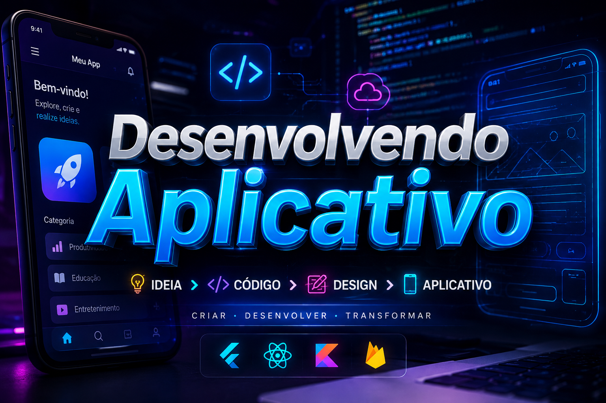

<div align="center">

  <!-- 👉 ESPAÇO PARA A IMAGEM / BANNER DO TOPO -->
  

  # 🚀 DEVELOP APPS

  <p><em>Um hub moderno, modular e escalável de aplicações Mobile, Web e Desktop de alta performance.</em></p>

  <!-- Badges de Status e Tecnologias -->
  <p>
    
    
    
    
  </p>

</div>

---

## 📋 Índice

* [Sobre o Projeto](#-sobre-o-projeto)
* [📱 Apps no Ecossistema](#-apps-no-ecossistema)
* [Principais Funcionalidades](#-principais-funcionalidades)
* [Tecnologias Utilizadas](#-tecnologias-utilizadas)
* [Como Executar o Projeto](#-como-executar-o-projeto)
* [Como Contribuir](#-como-contribuir)
* [Licença](#-licença)

---

## 📖 Sobre o Projeto

O **Develop_apps** é um ecossistema criado para centralizar, estruturar e simplificar o desenvolvimento de diversas aplicações (Mobile e Web). 
Aqui você encontrará projetos construídos com foco absoluto em **UI/UX**, alta performance e código limpo. O repositório serve como um *monorepo* (ou hub) onde exploramos todo o potencial de frameworks modernos como **Flutter** e **React**, integrados a back-ends robustos.

> **💡 Missão:** Unir as melhores práticas de engenharia de software (Clean Code, SOLID, Arquitetura Modular) para garantir aplicações multiplataforma de fácil manutenção e prontas para o mercado.

---

## 📱 Apps no Ecossistema

Aqui estão os principais aplicativos e interfaces que compõem este projeto:

| 📲 Plataforma | Nome do App / Projeto | Descrição Breve | Stack Principal |
| :--- | :--- | :--- | :--- |
| **Mobile** | `App Exemplo 1` | Aplicativo de gestão e produtividade com interface fluida. | Flutter / Dart |
| **Mobile** | `App Exemplo 2` | E-commerce com carrinho e sistema de pagamentos. | React Native |
| **Web** | `Painel Admin` | Dashboard gerencial para os apps mobile. | React / Vite |
| **Backend** | `Core API` | API centralizada que alimenta todos os aplicativos. | Node.js / Python |

*(Nota: Atualize a tabela acima conforme for criando seus apps!)*

---

## ✨ Principais Funcionalidades

* 🎨 **Multiplataforma (Cross-Platform):** Código escrito uma vez e executado no iOS, Android e Web.
* 🧩 **Arquitetura Modular:** Estrutura altamente desacoplada, separando regras de negócio da camada de UI.
* ⚡ **Alta Performance:** Uso de *State Management* eficiente (Provider/Riverpod no Flutter, Redux/Zustand no React).
* 🔒 **Segurança e Autenticação:** Boas práticas de proteção de dados, rotas e integração com JWT/Firebase.

---

## 🛠️ Tecnologias Utilizadas

Este ecossistema foi construído utilizando as melhores ferramentas do mercado:

| Categoria | Tecnologias |
| :--- | :--- |
| **Frontend & Mobile** | `Flutter, Dart, React.js, React Native, TypeScript` |
| **Backend (Integrações)**| `Node.js, Express, Python, FastAPI` |
| **Banco de Dados** | `PostgreSQL, MongoDB, Firebase` |
| **Design & UI** | `Tailwind CSS, Material Design, Cupertino` |
| **DevOps & Ferramentas** | `Docker, Git, GitHub Actions, Figma` |

---

## ⚙️ Como Executar o Projeto

Como o ecossistema possui diferentes tecnologias, escolha a aba correspondente ao aplicativo que deseja rodar:

<details>
<summary><strong>🔵 Rodando Projetos em Flutter (Mobile)</strong></summary>

1. Certifique-se de ter o [Flutter SDK](https://docs.flutter.dev/get-started/install) instalado.
2. Clone o repositório:
   ```bash
   git clone [https://github.com/SEU-USUARIO/Develop_apps.git](https://github.com/SEU-USUARIO/Develop_apps.git)